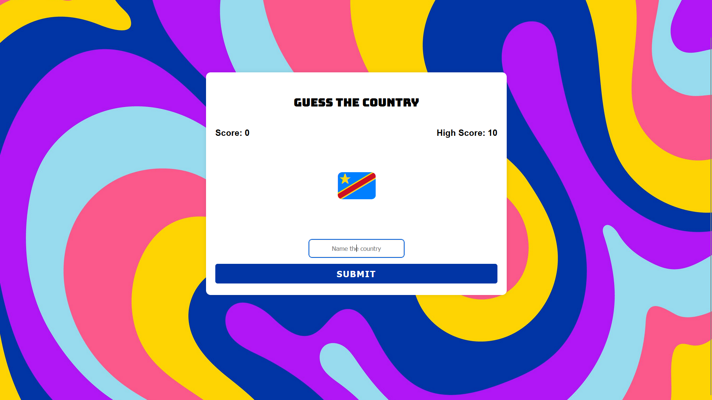
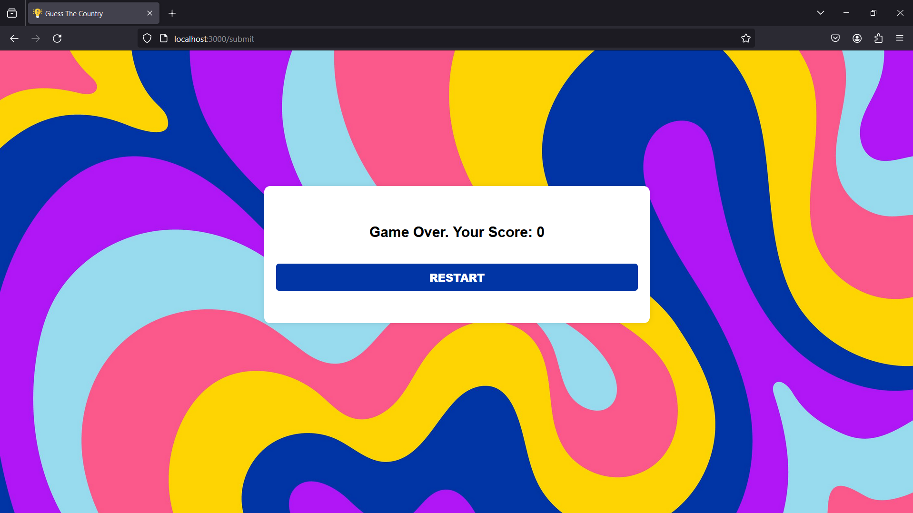

# **Guess The Country**

Welcome to **Guess The Country**, a simple and interactive web application that challenges users to guess the Country based of their unique flags. Test your knowledge and see how many countries you can correctly identify!

## Table of Contents
- [Description](#description)
- [Features](#features)
- [Installation](#installation)
- [Usage](#usage)
- [Technologies](#technologies)
- [UI](#ui)

## Description

**Guess The Country** is a web-based game that presents users with a flag and prompts them to enter the corresponding country. The application features a dynamic interface, real-time scoring, and a high score tracker to keep users engaged and challenged. The game leverages a PostgreSQL database to store information about countries and capitals, ensuring a diverse and educational experience.

## Features

- **Real-time Scoring:** Keep track of your current score and see how many countries you can guess correctly.
- **High Score:** Challenge yourself to beat your highest score and see how well you know the countries.
- **Interactive Interface:** User-friendly interface with animations for correct and incorrect answers.
- **Educational:** Learn the flags of different countries while playing the game.

## Installation

1. Ensure you have [Node.js](https://nodejs.org/) and [PostgreSQL](https://www.postgresql.org/) installed on your machine.
2. Clone the repository:
```bash
 git clone https://github.com/trigunom/Guess-The-Country.git
```
3. Navigate to the project directory:

```bash
cd project-directory
```
4. Install dependencies:
```bash
npm i
```
5. Create a PostgreSQL database named "world" and then create a table named `flags` as following:

| id [pk]         | name     | flag |
| ----------- | ----------- |---------|

6. Import the provided csv file `flags.csv` to finsh setting up the table.

7. Update the PostgreSQL connection details in `index.js` to match your local setup:

```
const db = new pg.Client({
  user: "your_username",
  host: "localhost",
  database: "world",
  password: "your_password",
  port: 5432,
});
```

## Usage

1. Start the server:
```bash
npm index.js
```

2. Open your web browser and go to `http://localhost:3000`

3. Start guessing the countries and enjoy the game!

**NOTE:** Use Mozilla Firefox or any similar web-browser that correctly displays the emoji/flags.

## Technologies

- **Node.js:** Server-side JavaScript runtime.
- **Express:** Web application framework for Node.js.
- **PostgreSQL:** Open-source relational database.
- **HTML, CSS, EJS:** Front-end technologies for building the user     interface.

## UI


